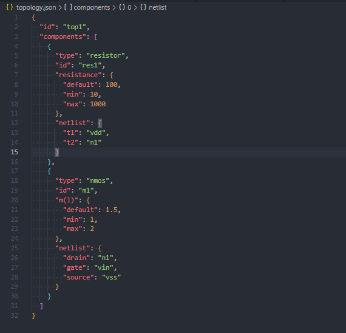
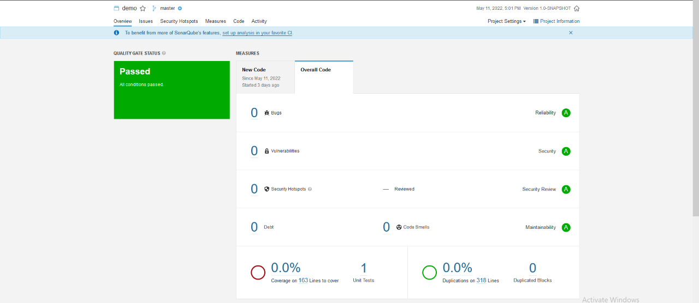

# Description

An API Library written in java library which does the following:

1. Read and write topologies to and from disk.
2. Stores multiple topologies in memory.
3. Execute operations on topologies. (query - delete - ...)

## A topology is a set of electronic components that are connected together.

### Example JSON file Screenshot



## Build Project using maven

after clonning project to your machine

```
mvn -B compile
```

## Run Project

### in vscode:

- open Main.java (src/main/java/com/example/Main.java)
- Right Click , Run java.

### any other editor

- open Main.java (src/main/java/com/example/Main.java)
- click run button

### Running Tests Result


## screenshot from sonarQube (Code analysis)

### SonarQube,at the beginning, detect some code smells regarding System.out.println in Main class, but i marked it as non-important


